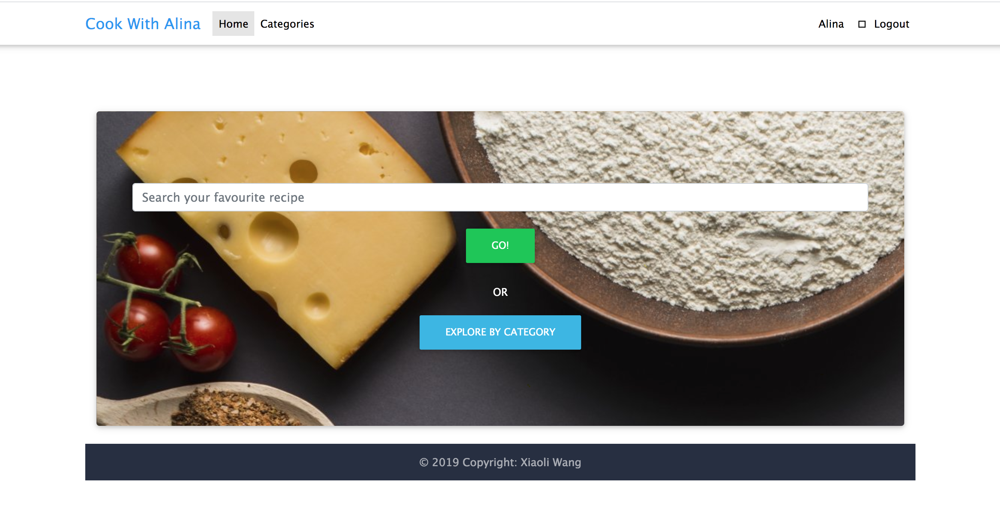
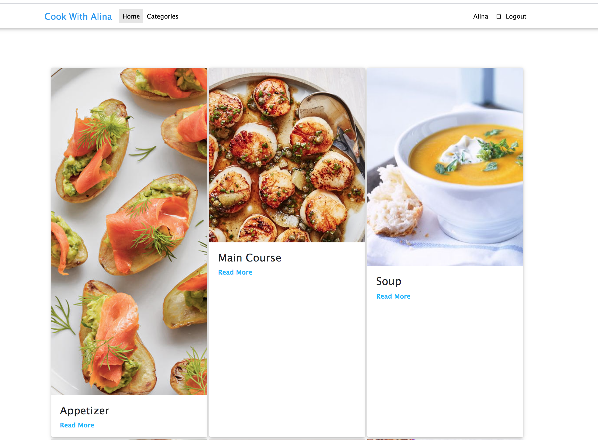
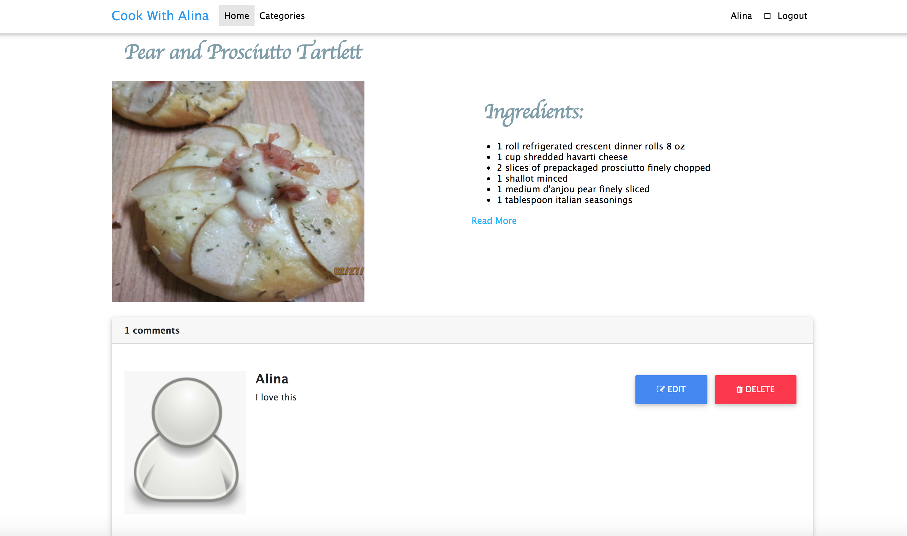
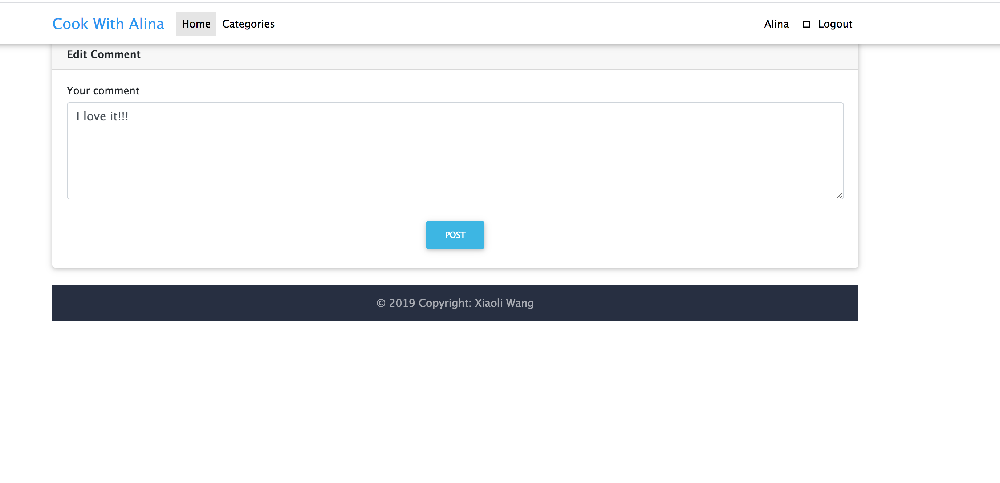

 # Webapp: Cook With Alina

Learn to cook with awesome online recipes, search over thousands of delicious foods with easy, or view top recipes from different categories.

## Screenshot

----
## Technologies Used: 
1.Node.Js

2.Express 

3.MongoDB 

4.RESTFUL API

5.Crud

5.Oauth

6.Bootstrap

7.material Icon

## Getting Started

[Here is my game](https://cook-with-alina.herokuapp.com)

## Next Steps: 

1. Allow users to save recipes
2. Authentication redirect to user's current page
3. Add filtering to searches